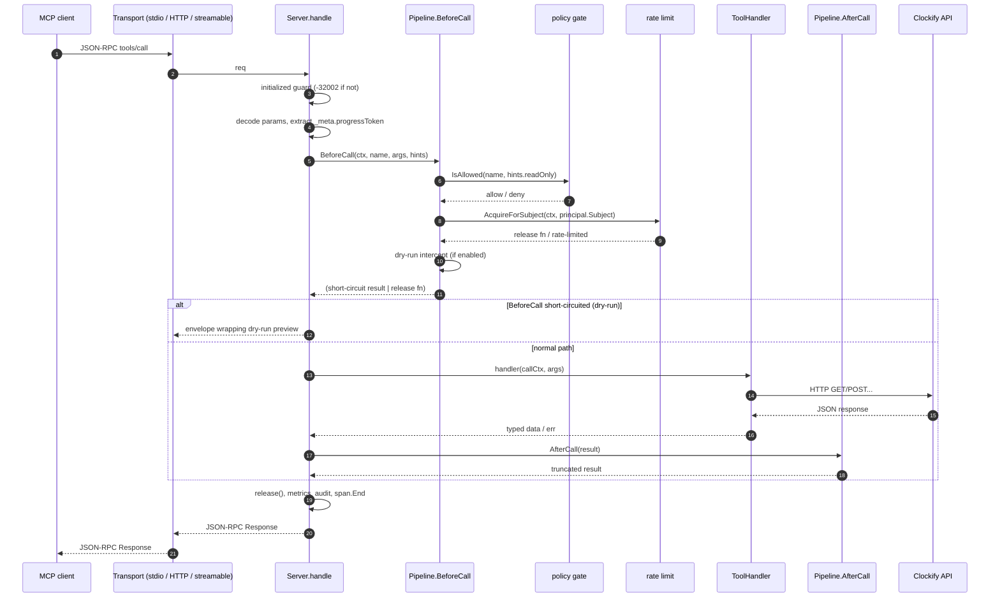
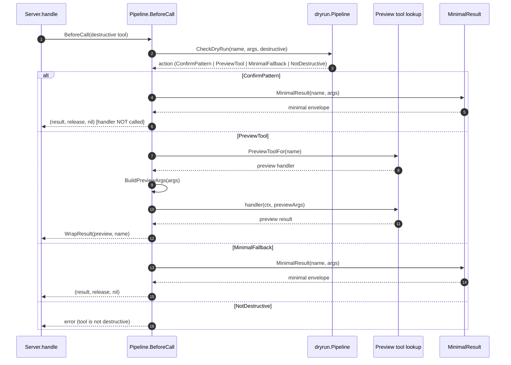
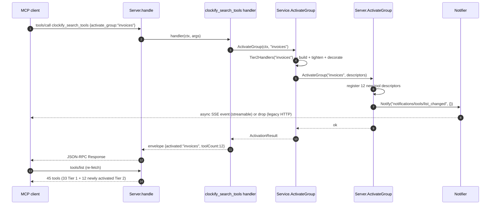
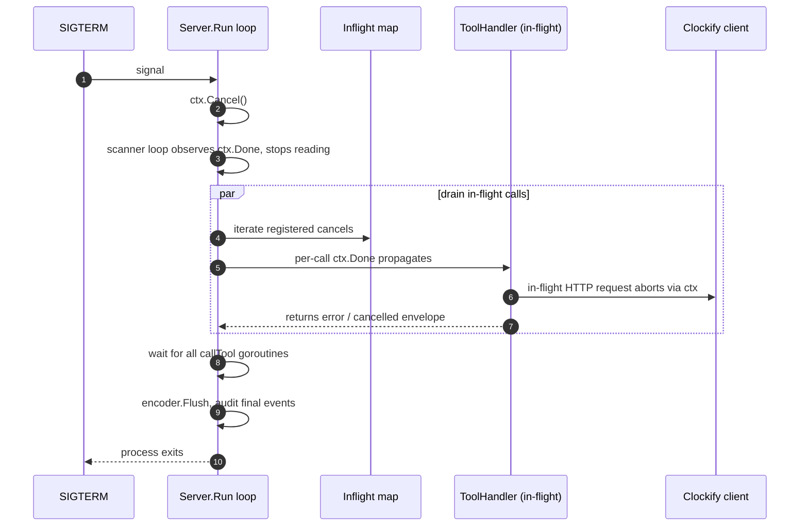
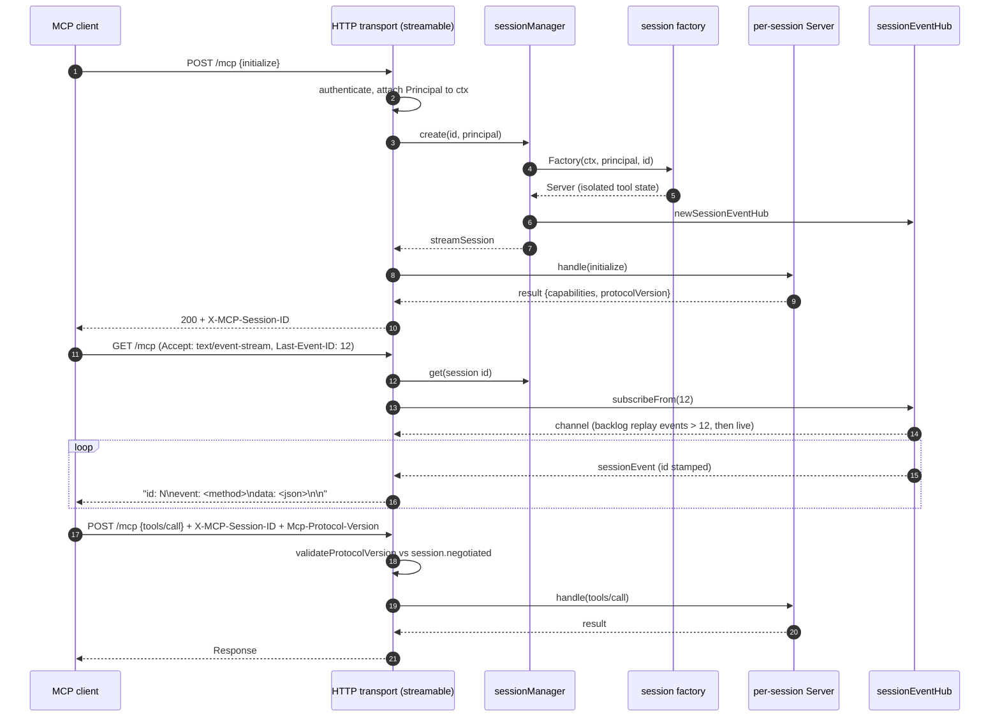

# GOCLMCP Architecture

This document explains the runtime structure of `clockify-mcp` — what each
layer owns, how a tool call flows end-to-end, and where the safety gates
sit. For the rationale behind individual design decisions (stdlib-only,
pluggable enforcement, dispatch vs. business-layer semaphores, …) see the
ADRs under [`docs/adr/`](adr/).

## Layer diagram

```
+--------------------------------------------------------------+
|                        MCP client                            |
|              (Claude Desktop, Cursor, curl, …)               |
+--------------------------------------------------------------+
                           | stdio | HTTP | streamable HTTP
                           v
+-----------------------------+  +-----------------------------+
|      Protocol core (mcp)    |  |  Transports                 |
|  - stdio loop               |  |  - stdio (Run)              |
|  - JSON-RPC dispatch        |<-|  - legacy HTTP (transport_  |
|  - tools/list, tools/call,  |  |    http.go)                 |
|    resources/*, prompts/*,  |  |  - streamable HTTP          |
|    initialize, ping,        |  |    (transport_streamable_   |
|    notifications/cancelled  |  |    http.go)                 |
|  - Server.callTool          |  +-----------------------------+
+--------------+--------------+
               |
     Enforcement interface (pluggable)
               |
               v
+--------------------------------------------------------------+
|                  Safety layer (enforcement)                  |
|   Pipeline.FilterTool / BeforeCall / AfterCall               |
|   - policy gate    (internal/policy)                         |
|   - rate limit     (internal/ratelimit, global + per-token)  |
|   - dry-run        (internal/dryrun)                         |
|   - truncation     (internal/truncate)                       |
|   - bootstrap      (internal/bootstrap)                      |
+--------------------------------------------------------------+
               |
     ToolHandler (registered in internal/tools)
               |
               v
+--------------------------------------------------------------+
|              Tool surface (internal/tools)                   |
|   Service struct with lazy user/workspace cache              |
|   - 33 Tier 1 handlers: users, workspaces, entries, timer,   |
|     projects, clients, tags, tasks, reports, workflows,      |
|     context/discovery, resources, prompts                    |
|   - 91 Tier 2 handlers across 11 lazy-loaded groups          |
+--------------------------------------------------------------+
               |
        Clockify HTTP client (internal/clockify)
               |
               v
+--------------------------------------------------------------+
|                    Clockify API                              |
+--------------------------------------------------------------+
```

## 1. Tool-call enforcement flow

Every `tools/call` traverses the same pipeline, regardless of transport.



## 2. Dry-run interception



## 3. Tier 2 activation



## 4. Graceful shutdown (stdio transport)



## 5. Streamable HTTP session lifecycle



## Related

- [Wave 1 backlog](wave1-backlog.md) — curated remaining work and landed items
- [Observability](observability.md) — metrics, SLOs, alerts, tracing
- [HTTP transport guide](http-transport.md)
- [Runbooks](runbooks/)
- [Architecture Decision Records](adr/)
